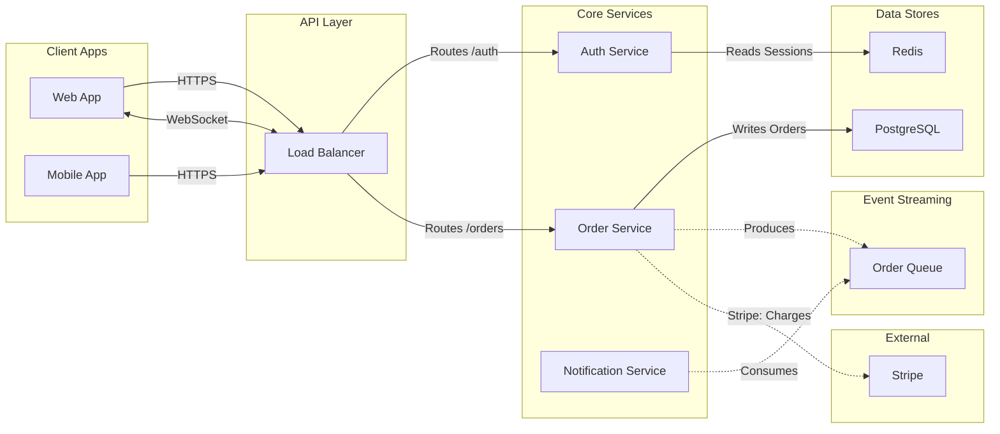

# Architecture Diagrams

Use this reference when the user asks for a **software architecture diagram** — a view showing services, datastores, message queues, external integrations, and how they connect. These are flowcharts rendered by a bespoke grid-based layout (not ELK), controlled by the `useArchitectureLayoutCode` parameter on `generate_diagram`.

For generic flowcharts (decision trees, process flows, dependency graphs), use [flowchart.md](./flowchart.md) instead.

---

## Rules (read all before writing any Mermaid)

1. Always `flowchart LR` (left-to-right).
2. Every node = one independently deployable unit. Never decompose a service into internal modules.
3. **Every node MUST be inside a subgraph.** No `classDef`, `class`, or `style` statements needed.
4. **Subgraph IDs must be EXACTLY one of:** `client`, `gateway`, `service`, `datastore`, `external`, `async`. Use display labels for titles: `subgraph service ["Core Services"]`. **WRONG:** `subgraph Services`. **RIGHT:** `subgraph service`.
5. Core flow edges use `-->` or `<-->` and must form a DAG across client -> gateway -> service -> datastore (no cycles) or the tool will error.
6. Bidirectional edges must be written in forward direction: `client <-->|"WS"| gateway` not `gateway <-->|"WS"| client`. Bidirectional async (`<-.->`) is not supported and will fall back to a forward edge.
7. **Backward edges** use `<---`: write left node first, arrow points left. `orderService <---|"Refund"| paymentService`.
8. **ALL edges touching an async or external node MUST use dotted syntax (`-.->`)** for both directions. Never use `==>`.
9. Never connect edges to subgraph IDs — only individual node IDs.
10. Never create two edges between the same pair of nodes. Combine into one edge with a merged label.
11. **Never connect datastore or async nodes to each other directly.** A service always mediates. WRONG: `kafka -.-> sqs`. RIGHT: `worker -.->|"Consumes"| kafka` then `worker -.->|"Produces"| sqs`.

## Subgraph Categories

Layout order: client -> gateway -> service -> datastore. External and async are placed above/below the service+datastore lanes. Colors and shapes are auto-assigned — use plain `[text]` syntax for all nodes.

| Subgraph ID | What Belongs Here |
| --- | --- |
| `client` | Web/mobile/desktop apps, CLI, end users |
| `gateway` | CDN, load balancer, API gateway, reverse proxy |
| `service` | Microservices, monoliths, serverless, ETL, async workers, cron jobs |
| `datastore` | Databases, caches, object storage (PostgreSQL, Redis, S3, Elasticsearch) |
| `external` | Feature flags, monitoring, payment, OAuth, third-party SaaS |
| `async` | Message infrastructure: Kafka, RabbitMQ, SQS, Pub/Sub, EventBridge, Redis Streams |

## Async Subgraph

**Async nodes = independently deployable message infrastructure.**

Does NOT belong in `async`:

- Consumer workers -> `service`
- DB replication features (WAL, CDC) -> omit or use a dotted edge label from `datastore`
- Logical splits of a single broker -> use one node

Canonical pattern: `service -.->|"Produce"| queue` and `queue -.->|"Consume"| service`

## Node Granularity

"Can I deploy, restart, or scale this independently?" Yes = node. No = omit.

## Edge Types

| Category | Syntax | Use For |
| --- | --- | --- |
| **Forward** | `-->` | Normal left-to-right data flow |
| **Bidirectional** | `<-->` | WebSocket, gRPC streaming (write in forward direction) |
| **Backward** | `<---` | Return flows, invalidation (left node first) |
| **Async/External** | `-.->` | Any edge touching async or external nodes |

### Edge Decision

1. Either endpoint is async or external? -> `-.->`
2. Real-time bidirectional channel? -> `<-->`
3. Backward-flowing between core nodes? -> `<---` (left node first)
4. Otherwise -> `-->`

### Key Patterns

| Pattern              | Syntax | Label Examples         |
| -------------------- | ------ | ---------------------- |
| client -> gateway    | `-->`  | "HTTPS"                |
| service -> datastore | `-->`  | "Read/Write", "Query"  |
| service -> async     | `-.->` | "Produce Events"       |
| async -> service     | `-.->` | "Consume", "Fan Out"   |
| service -> external  | `-.->` | "ServiceName: Purpose" |
| service <- service   | `<---` | "Invalidate", "Refund" |

> **External edges** render to the section boundary. Include the service name in the label: `"ServiceName: Purpose"`.

### Best Practices

1. **One flow per diagram.** Focus on the architecture the user asked about.
2. **Max 15-20 edges.** Omit edges unrelated to the requested flow.
3. **Label every cross-subgraph edge.** Use a verb from the source node's perspective, with specifics when relevant (e.g., "Reads Users", "Writes Orders", "Produces"). 1-4 words max.
4. **Bidirectional = one `<-->` edge.** Never split into separate `-->` and `-.->`.

## Validation Checklist

Before finalizing the diagram, verify:

1. **Forward and bidirectional edges must form a DAG.** Any edges that would form a cycle must be represented as a backward edge.
2. **Every service has both input and output.** For each service node, ask: "Where does it get data from?" and "Where does it return data to?" If either answer is missing, add the edge.
3. **Walk each service node one by one.** List every service node, then for each one confirm it has at least one incoming edge and one outgoing edge. If not, fix it before calling generate_diagram.
4. **Do not hallucinate labels or edges.** Ask the user questions when there is ambiguity.

## Mermaid Syntax Rules

1. Node IDs: camelCase, no spaces or underscores (`userService` not `user service` or `user_service`). The layout code splits on `_` internally, so underscores in IDs will break edge routing.
2. Labels with special chars: wrap in double quotes (`A["Process (main)"]`).
3. Edge labels with special chars: wrap in quotes (`-->|"O(1) lookup"|`).
4. Avoid reserved words as node IDs: `end`, `subgraph`, `graph`.
5. No HTML tags or emojis in labels.

## Complete Example

## Calling generate_diagram

When calling `generate_diagram` for an architecture diagram, pass:

- `name`: A descriptive diagram name
- `mermaidSyntax`: Your Mermaid syntax following all rules above
- `useArchitectureLayoutCode`: `"FIGMA_DIAGRAM_2026"`
- `userIntent` (optional): What the user is trying to accomplish
