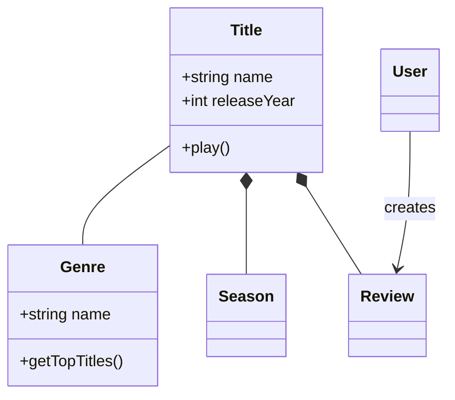
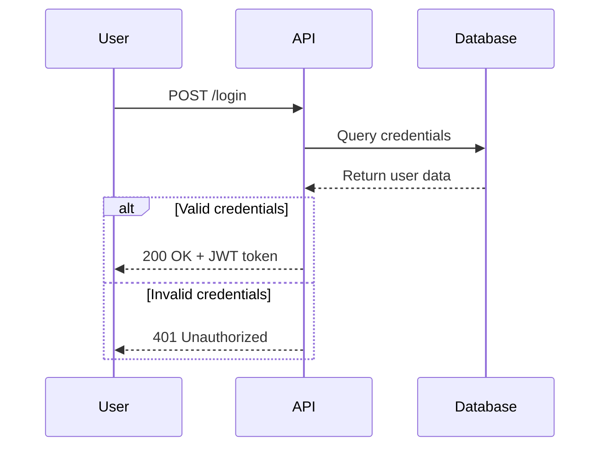
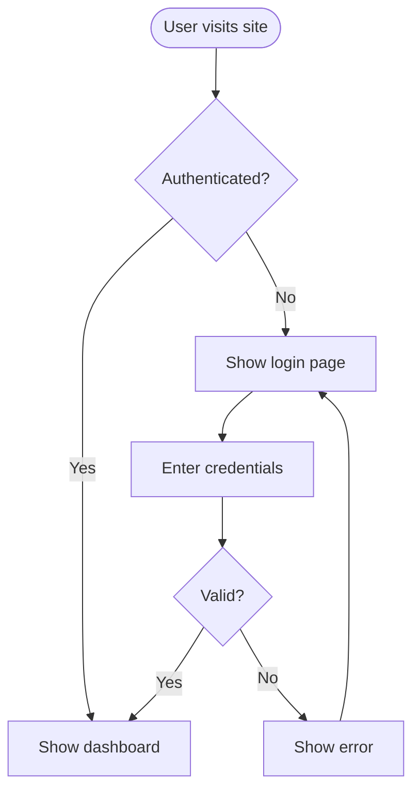
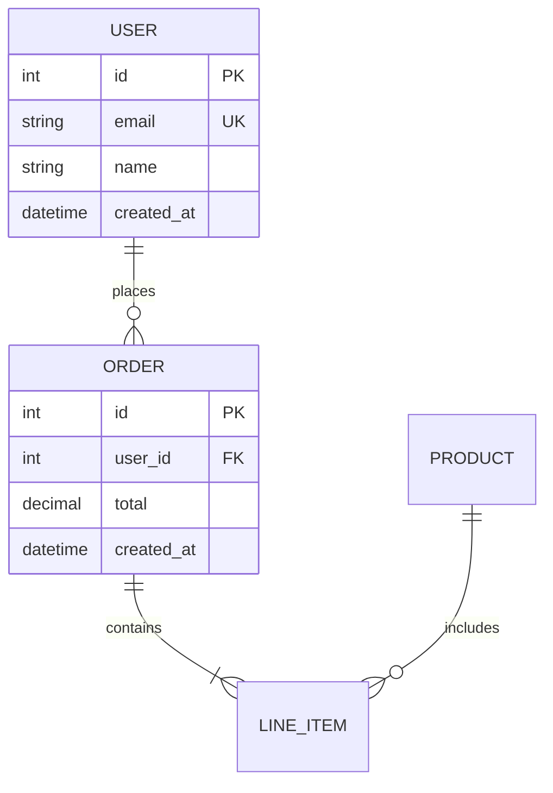
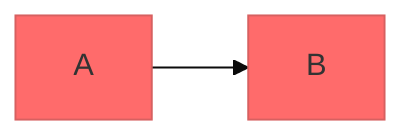

# Mermaid Diagramming

Create professional software diagrams using Mermaid's text-based syntax. Mermaid renders diagrams as version-controllable, maintainable documentation alongside code.

## Expert Thinking Framework: Choose Your Diagram Type

**Before creating any diagram, ask yourself:**

### 1. What am I showing?

- **Temporal sequence** (who talks to whom, in what order?) → **Sequence Diagram**
- **Structural relationships** (what objects exist, how are they related?) → **Class Diagram**
- **Process/workflow** (steps, decision points, branches?) → **Flowchart**
- **Data model** (tables, fields, cardinality, keys?) → **Entity Relationship Diagram (ERD)**
- **System scope** (components, containers, actors, boundaries?) → **C4 Diagram**
- **Lifecycle states** (what transitions are valid?) → **State Diagram**

### 2. What's the audience?

- **Domain experts** → Class Diagram or ERD
- **Stakeholders/executives** → C4 Context or Flowchart
- **Developers** → Sequence Diagram or Component architecture
- **Ops/infrastructure teams** → C4 Container + Architecture Diagram

### 3. What complexity level am I at?

- **System-wide scope** → C4 Context Diagram
- **Component internals** → C4 Component Diagram or Sequence Diagram
- **Object interactions** → Class Diagram + Sequence Diagram (paired)
- **Single workflow** → Flowchart

### 4. What trade-offs matter?

| Diagram Type | Strength | Weakness | When to choose |
| --- | --- | --- | --- |
| **Class Diagram** | Shows all relationships at once | Gets messy with >10 classes | Domain modeling, static structure |
| **Sequence Diagram** | Clear temporal flow | Unreadable with >8 participants | API flows, authentication, method calls |
| **Flowchart** | Intuitive for non-technical | Oversimplifies complex logic | User journeys, processes, algorithms |
| **ERD** | Schema clarity | Doesn't show system boundaries | Database design, table relationships |
| **C4 Diagram** | Progressive detail (context→component) | Requires multiple diagrams | Large systems, architecture decisions |
| **State Diagram** | Captures all valid transitions | Verbose for simple states | State machines, workflow engines |

**Diagram type overview:**

1. **Class Diagrams** — Domain modeling, OOP design, entity relationships
2. **Sequence Diagrams** — Temporal interactions, message flows, API sequences
3. **Flowcharts** — Processes, algorithms, decision trees, user journeys
4. **Entity Relationship Diagrams (ERD)** — Database schemas, table relationships
5. **C4 Diagrams** — Software architecture at multiple levels (Context → Container → Component)
6. **State Diagrams** — State machines, lifecycle states
7. **Git Graphs** — Version control branching strategies
8. **Gantt Charts** — Project timelines, scheduling
9. **Pie/Bar Charts** — Data visualization

## Quick Start Examples

### Class Diagram (Domain Model)

### Sequence Diagram (API Flow)

### Flowchart (User Journey)

### ERD (Database Schema)

## Detailed References

For in-depth guidance on specific diagram types, you MUST read the relevant reference file completely before creating complex diagrams:

- **[MANDATORY for class design](references/class-diagrams.md)** — Read when creating domain models with >5 classes or complex inheritance hierarchies
- **[MANDATORY for sequence flows](references/sequence-diagrams.md)** — Read when showing API interactions, auth flows, or multi-step processes
- **[MANDATORY for process diagrams](references/flowcharts.md)** — Read when mapping user journeys, business processes, or algorithms
- **[MANDATORY for database design](references/erd-diagrams.md)** — Read when designing schema or showing data relationships
- **[MANDATORY for architecture](references/c4-diagrams.md)** — Read when documenting system boundaries or component interactions
- **[MANDATORY for infrastructure](references/architecture-diagrams.md)** — Read when showing cloud services or CI/CD deployments
- **[OPTIONAL for styling](references/advanced-features.md)** — Read only for custom themes, colors, or layout optimization

**Do NOT load other reference files for this task.**

## Expert Anti-Patterns: NEVER Do This

**Expert-level mistakes that only experience teaches:**

### 1. NEVER use class diagrams for workflows

- **Why**: Class diagrams show static structure; workflows need temporal flow
- **Wrong**: Class diagram with 20 classes showing request/response journey
- **Right**: Sequence diagram for temporal flow + separate class diagram for domain model
- **Fix**: If you're showing "then this happens," use Sequence or Flowchart

### 2. NEVER create sequence diagrams with >8 participants

- **Why**: Readability collapses exponentially; lines cross chaotically
- **Wrong**: 12-participant API flow (authentication service, payment, inventory, shipping, email, logging, etc.)
- **Right**: Split into 2-3 focused sequence diagrams (user-to-API, API-to-payment, notification flow)
- **Fix**: Ask "what's the primary flow?" — keep only essential participants

### 3. NEVER use ERD to show system boundaries

- **Why**: ERDs document schema (tables/fields); C4 documents architecture (systems/boundaries)
- **Wrong**: ERD with "external payment service" and "internal order table"
- **Right**: C4 Context showing all systems, then ERD for internal database only
- **Fix**: If showing "what systems interact," use C4. If showing "table relationships," use ERD

### 4. NEVER cram labels into nodes without whitespace

- **Why**: Dense labels make diagrams unreadable; viewers can't scan visually
- **Wrong**: `[CompleteUserOnboardingWorkflowWithMultipleStepValidation]`
- **Right**: Split into multiple smaller boxes: `[Check Email] → [Verify Email] → [Complete Profile] → [Activate]`
- **Fix**: One concept per node. Use notes for context

### 5. NEVER use overly deep inheritance hierarchies (>3 levels)

- **Why**: Hard to follow; usually indicates design problem; composition is better
- **Wrong**: `Animal → Mammal → Carnivore → FelineCarnivore → DomesticCat`
- **Right**: Use composition or limit to 2 levels; consider horizontal interfaces instead
- **Fix**: Ask "why so deep?" — usually answer is "use composition instead"

### 6. NEVER put all code details in architecture diagram

- **Why**: Creates maintenance burden; architecture should be stable, code changes frequently
- **Wrong**: C4 Component diagram listing every method name and parameter
- **Right**: Architecture shows structure + responsibility; code docs show implementation
- **Fix**: Architecture = "what boxes exist, what do they do"; code = "how do they do it"

## Best Practices for Expert Diagrams

1. **One diagram per concept** — If you need "and also..." you need a second diagram
2. **Let whitespace breathe** — Dense diagrams are unreadable; fewer nodes are better
3. **Choose diagram type before drawing** — Use the thinking framework above; wrong type is worse than no diagram
4. **Document trade-offs** — Add notes explaining "why this structure, not alternatives"
5. **Version with code** — Store `.mmd` files alongside implementation; update together

## Troubleshooting & Edge Cases

### When Diagram Won't Render

| Symptom | Likely Cause | Fix |
| --- | --- | --- |
| "Parse error on line X" | Syntax error in definition | Use [Mermaid Live Editor](https://mermaid.live) for line-by-line debugging; check spelling of keywords |
| Blank output | Unrecognized keyword or diagram type | Verify diagram type (e.g., `classDiagram` not `classdiagram`); validate syntax online |
| Participants jumbled (sequence) | Sequence diagram too complex (>8 participants) | Split into 2-3 focused sequence diagrams; keep only critical interactions |
| Classes overlap (class diagram) | Class diagram too large (>10 classes) | Split into focused domain models; use separate diagrams for different subdomains |
| Relationships unclear | Missing labels or cardinality notation | Add explicit relationship labels; use proper cardinality symbols (`1..* `, `0..1`, etc.) |

### When a Diagram Becomes Too Complex

**Symptom**: "This diagram is hard to understand; I keep adding details."

**Size limits per diagram type**:

- **Class Diagram**: 5-10 classes is ideal; >15 needs splitting
- **Sequence Diagram**: 4-8 participants is ideal; >10 becomes unreadable
- **Flowchart**: 10-15 nodes is ideal; >20 needs hierarchy/subgraphs
- **ERD**: 5-8 core tables is ideal; >12 needs splitting by subdomain
- **C4 Context**: 4-6 systems is ideal; shows full ecosystem
- **C4 Component**: 6-10 components is ideal; more needs further decomposition

**Splitting strategy**:

1. **Identify subdomain/concern**: "This group of classes models payments; these model orders"
2. **Create separate focused diagram**: One diagram per cohesive concept
3. **Link diagrams**: Add notes showing relationships between separate diagrams
4. **Example**: Instead of one 20-class diagram: Class Diagram A (User domain) + Class Diagram B (Order domain) + Class Diagram C (Payment domain)

### Very Large Systems (100+ Nodes)

**Problem**: Can't fit everything in one diagram without collapsing readability.

**Solution**: Use C4 layered approach (proven for large systems)

- **C4 Context**: System boundary + external systems only (4-6 boxes)
- **C4 Container**: Internal apps/databases/services (6-10 boxes)
- **C4 Component**: Individual component internals (6-10 boxes each)
- **Don't create**: One giant "architecture diagram" with 100+ nodes

### Conflicting Views (Different Stakeholders See It Differently)

**Problem**: Your class diagram shows implementation details; stakeholders want conceptual model.

**Solution**: Create multiple diagrams

- **Conceptual Model**: High-level domain entities (for business/stakeholders)
- **Implementation Model**: Actual classes with all methods (for developers)
- **API Contract**: Request/response flows (for integrators)
- **Each diagram** answers different "what" and serves different audience

### Evolving Systems (Diagram Changes Frequently)

**Problem**: Diagram is outdated; not tracking with code changes.

**Solution**:

1. **Store `.mmd` files in version control** alongside code
2. **Add to code review**: Changes to architecture need diagram updates
3. **Create multiple versions**: `UserService-v1.mmd`, `UserService-v2.mmd` if dramatic refactor
4. **Version diagrams with releases**: Mark diagrams as "applies to v2.0+" in notes

## When to Create Diagrams (Expert Guidance)

**Create diagrams BEFORE coding** (not after):

- **New feature design**: Diagram first, code after. Catches design issues early
- **Complex workflows**: If you can't draw it, you don't understand it yet
- **Database schema**: ERD forces thinking about relationships before implementation
- **Refactoring decisions**: Diagram current state → target state to validate approach

**DO NOT diagram**:

- Simple CRUD operations (diagram adds no clarity)
- Single-responsibility classes (too simple to diagram)
- Framework/library internals (external; not your domain)
- Everything (diagrams have maintenance cost; choose strategically)

**Update diagrams when**:

- Architecture changes (C4 context/container layers)
- Major new subsystem added
- Refactoring significantly changes structure
- **NOT every minor code change** (that's noise, not documentation)

## Configuration and Theming (Optional)

Configure appearance using frontmatter:

**Available themes**: default, forest, dark, neutral, base | **Layout**: `layout: dagre` (default) or `layout: elk` | **Look**: `look: classic` or `look: handDrawn`

## Exporting and Rendering

**Native support**: GitHub/GitLab (auto-renders), VS Code (Mermaid extension), Notion, Obsidian, Confluence

**Export**: [Mermaid Live Editor](https://mermaid.live) for PNG/SVG | CLI: `npm install -g @mermaid-js/mermaid-cli` then `mmdc -i input.mmd -o output.png`
