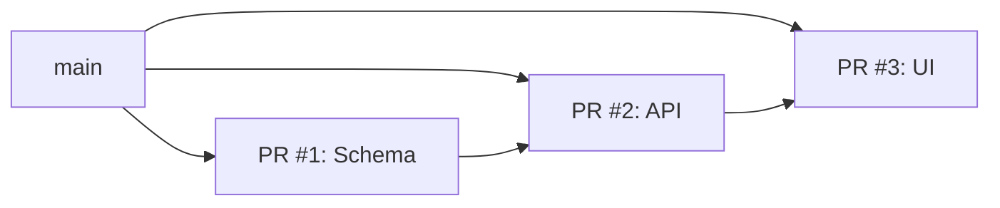

# Split to PRs

Turn one pile of work into a few small PRs. This skill provides comprehensive guidance for breaking down large changes into manageable, reviewable pull requests across all AI agent platforms (OpenCode, Cursor, GitHub Copilot).

## Hard Rules

- Do not create branches, commit, push, or open PRs until the user approves the split plan.
- Never discard user work. No destructive git commands (`reset --hard`, `clean -fdx`, branch deletion, force-push, history rewrite) without explicit approval.
- Always save a recoverable snapshot before moving work around. This often starts from dirty work on `main`, so do not assume there is already a safe branch.
- Stage only named files or hunks. No `git add .` / `git add -A`.

## Platform-Specific Considerations

### OpenCode

In OpenCode, use the native git tools:
- Use `bash` tool for git commands
- Create branches via `gh pr create` after pushing
- Track progress with todo items

### Cursor

In Cursor IDE:
- Use the terminal integration for git operations
- Leverage Cmd/Ctrl+Shift+P for git commands
- Can use the built-in GitHub integration for PRs

### GitHub Copilot

In Copilot CLI or VS Code:
- Use VS Code's built-in Git tooling
- Leverage Copilot chat for explaining git concepts
- Use extension features for PR management

## 1. Check the State

Compare the current work to the repo's default branch, including committed and uncommitted changes. Summarize the real slices you see, and use the chat history to recover intent.

### How to Inspect Current State

```bash
# View all changes compared to main
git diff main...HEAD

# View staged and unstaged changes
git status

# See commit history
git log --oneline -20

# View specific file changes
git diff -- path/to/file
```

### OpenCode Tool Usage

```typescript
// Use bash tool to inspect state
bash({ command: "git status --short", description: "Check git status" })
bash({ command: "git diff --stat", description: "View change statistics" })
```

### Cursor Tool Usage

```typescript
// Use terminal for git commands
await terminal.exec("git status")
await terminal.exec("git diff main...HEAD --stat")
```

## 2. Propose the Split

Use judgment on detail. Usually PR titles are enough. Add a one-line scope note only when a title is unclear. Show a Mermaid diagram when there are multiple slices.

Default to independent PRs off the default branch. Stack PRs only when the dependency is real.

Ask for approval before starting.

### PR Title Format

Use conventional commit format for PR titles:

| Type | Example |
|------|---------|
| feat | feat: add user authentication |
| fix | fix: resolve login timeout issue |
| refactor | refactor: simplify payment logic |
| docs | docs: update API documentation |
| test | test: add unit tests for auth module |
| chore | chore: update dependencies |

### Mermaid Diagram Example



## 3. Execute the Split

- If there is uncommitted work, save a recoverable snapshot without changing the working tree:

```bash
SHA=$(git stash create "pre-split")
if [ -n "$SHA" ]; then
  git update-ref "refs/backup/pre-split-$(date +%s)" "$SHA"
fi
```

- For each approved slice, create a branch from the right base, stage and commit only the planned files or hunks, then push and open the PR.

### Branch Creation Strategy

```bash
# Create branch from main for each PR
git checkout main
git pull origin main
git checkout -b feature/schema-changes

# Stage specific files only
git add path/to/schema.ts
git add path/to/migrations/

# Commit with conventional format
git commit -m "feat: add user schema and migrations"
```

### Opening PRs

```bash
# Push branch and create PR
git push -u origin feature/schema-changes

# Create PR using gh CLI
gh pr create --title "feat: add user schema and migrations" \
  --body "## Summary\n- Added user table schema\n- Created migration files"
```

## 4. Report Back

Keep it short: PR titles and URLs, plus anything left on the starting branch or working tree. Do not delete the backup ref or original branch unless the user asks.

## Advanced Splitting Strategies

### Strategy 1: Feature-Based Slicing

Split by independent features that can ship independently:

- **Core feature PR**: The main functionality being built
- **UI/components PR**: Reusable UI components introduced
- **Tests PR**: Test coverage for the feature
- **Documentation PR**: README updates, API docs

### Strategy 2: Layer-Based Slicing

Split by application layer:

- **Database/schema PR**: Schema changes, migrations
- **API PR**: Backend endpoints, business logic
- **Frontend PR**: UI components, pages
- **Integration PR**: Wiring everything together

### Strategy 3: Dependency-Aware Slicing

When slices have dependencies, create a stack:

```
main
  ├── PR #1: Foundation (schema, types)
  ├── PR #2: Core (business logic) depends on #1
  ├── PR #3: API layer depends on #2
  └── PR #4: UI depends on #3
```

## Common Split Patterns

### Pattern: New Feature

| PR | Contents |
| --- | --- |
| #1 Schema & Types | Database schema, TypeScript interfaces |
| #2 Business Logic | Service layer, validation, core functions |
| #3 API Endpoints | Route handlers, controllers |
| #4 UI Components | React components, pages |

### Pattern: Bug Fix

| PR | Contents |
| --- | --- |
| #1 Root Cause | Core fix, no UI changes |
| #2 Tests | Test case that catches the bug |
| #3 UI (if needed) | Any visual changes |

### Pattern: Refactoring

| PR | Contents |
| --- | --- |
| #1 Infrastructure | New patterns, utilities |
| #2 Migration | Update call sites incrementally |
| #3 Cleanup | Remove old code after migration |

## Handling Special Cases

### Case: Mixed Changes

When work includes multiple unrelated changes:
1. Identify each independent piece
2. Propose separate PRs for each
3. Mark one as the "main" PR if needed

### Case: Large Feature

For features with many files:
1. Break into logical milestones
2. Each milestone = one PR
3. Use feature flags to disable incomplete features

### Case: Work-in-Progress

If some changes are incomplete:
1. Ship complete PRs first
2. Mark incomplete work as "WIP" or draft
3. Keep WIP branches until ready

## Best Practices

1. **Keep PRs under 400 files** - Easier to review
2. **One concern per PR** - Don't mix refactoring with new features
3. **Self-contained PRs** - Each should compile and pass tests
4. **Descriptive titles** - Use conventional commit format
5. **Atomic commits** - Each commit should be meaningful

## Validation Before Proposing

Before presenting the split plan:

- [ ] Each PR can be merged independently
- [ ] No circular dependencies between PRs
- [ ] Each PR passes existing tests
- [ ] PR titles clearly describe the scope
- [ ] Backup ref created for recovery

## Recovery Procedures

### If a PR Fails Review

1. Don't force push or reset
2. Create a new branch from the PR branch
3. Make requested changes
4. Force push to update the PR

### If You Need to Abandon a Slice

1. Never delete branches without approval
2. Keep backup ref until explicitly told to delete
3. Document what was abandoned and why

## Cross-Platform Commands Reference

### Git Status

| Platform | Command |
|----------|---------|
| OpenCode | `bash({ command: "git status" })` |
| Cursor | Terminal: `git status` |
| Copilot | Terminal: `git status` |

### Create Branch

| Platform | Command |
|----------|---------|
| OpenCode | `bash({ command: "git checkout -b branch-name" })` |
| Cursor | Terminal: `git checkout -b branch-name` |
| Copilot | Terminal: `git checkout -b branch-name` |

### Stage Files

| Platform | Command |
|----------|---------|
| OpenCode | `bash({ command: "git add path/to/file" })` |
| Cursor | Terminal: `git add path/to/file` |
| Copilot | Terminal: `git add path/to/file` |

## Troubleshooting

### Issue: Cannot determine what files to split

1. Run `git diff --stat` to see all changed files
2. Group files by directory or feature
3. Look for natural boundaries (separate components, layers)

### Issue: User wants all changes in one PR

1. Explain the benefits of splitting
2. Show how many files each PR would contain
3. Ask if they have a specific reason for single PR

### Issue: Changes are tightly coupled

1. Identify the minimal set of files that must be together
2. Create a "core" PR with shared code
3. Stack dependent PRs on top

## Related Skills

- `git-commit` - For creating proper commit messages
- `code-review` - For reviewing PRs after splitting
- `babysit` - For maintaining PRs through review cycles
- `gh-cli` - For GitHub CLI commands

## Notes

- Always get user approval before executing the split
- Keep backup refs until explicitly told to clean up
- Document any abandoned work for future reference
- Consider using `git worktree` for parallel PR development